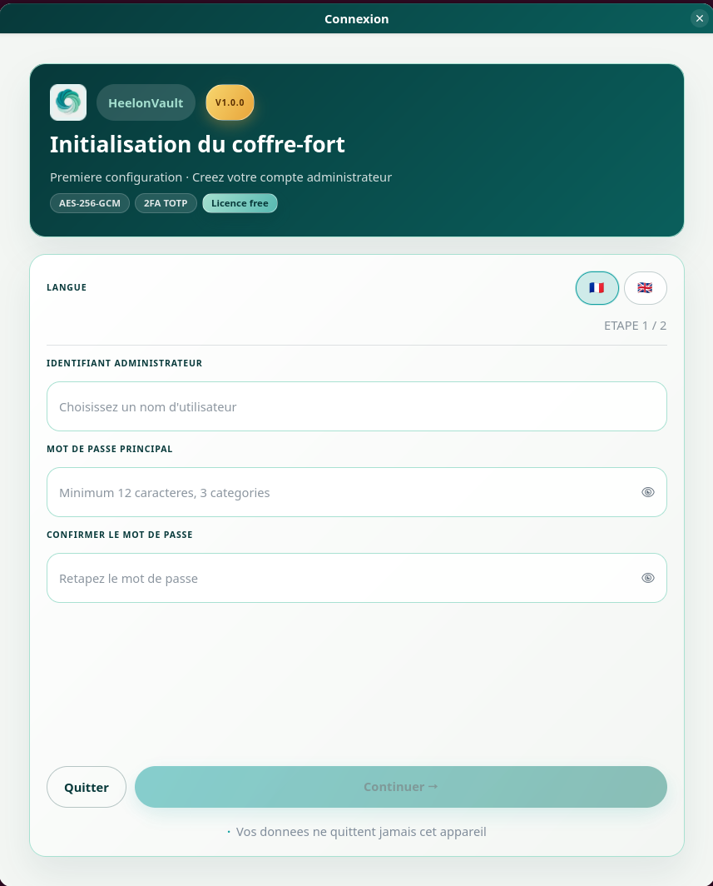
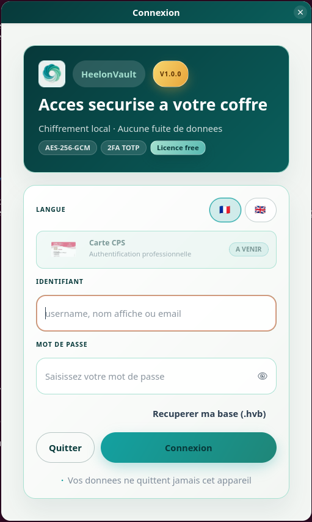
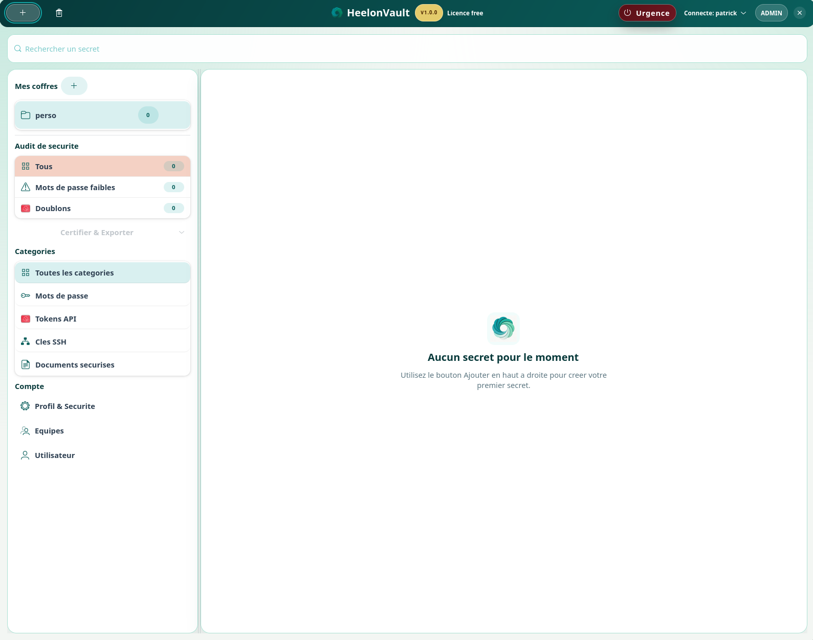
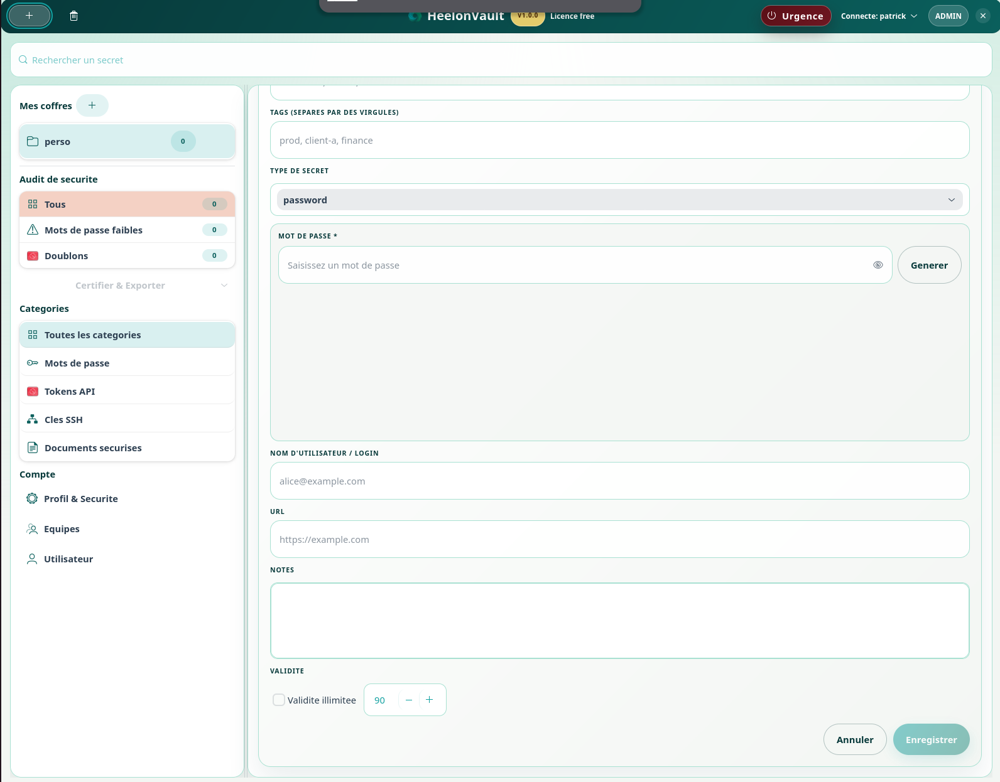
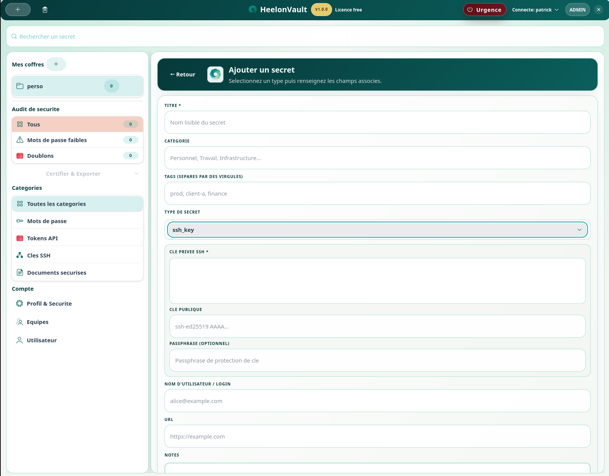
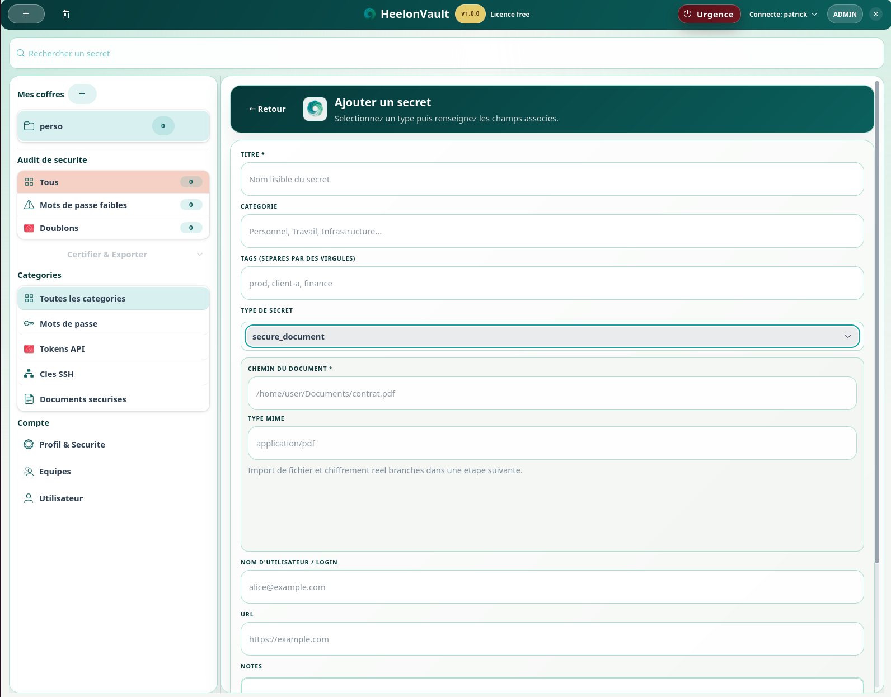
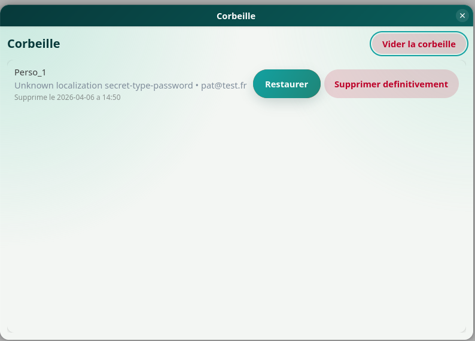
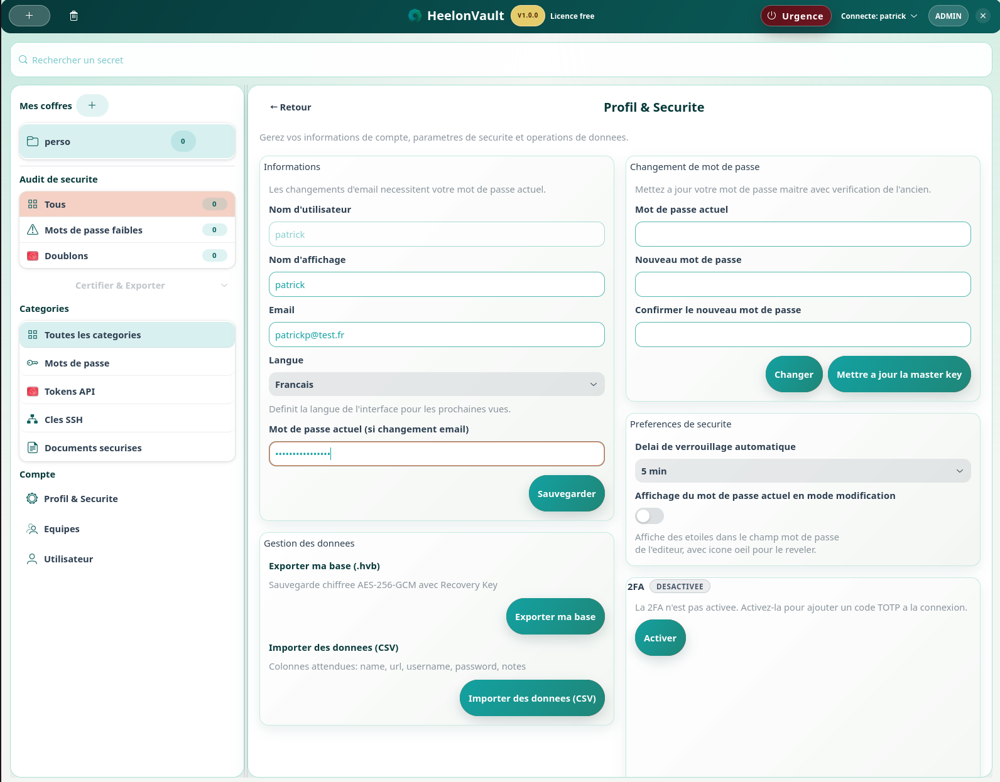
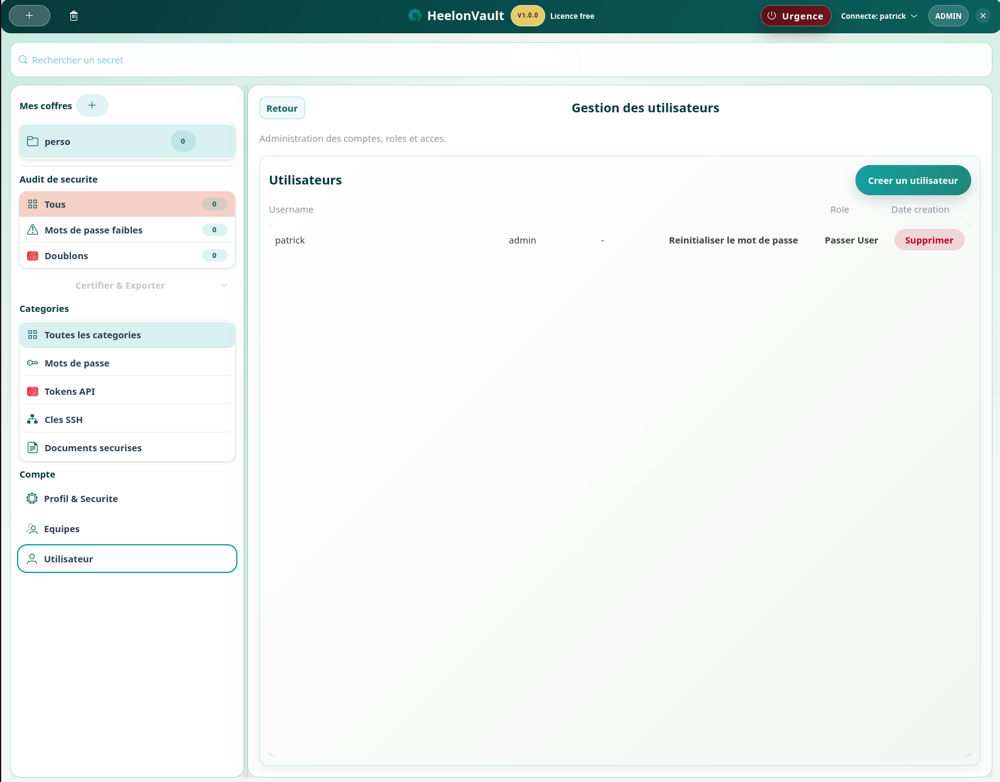

# Guide utilisateur

Langue : FR | [EN](USER_GUIDE.en.md)

Version cible documentée : `1.0.3`

## Objectif

Ce manuel utilisateur présente l'utilisation de HeelonVault dans un contexte opérationnel quotidien. Il s'adresse aux utilisateurs finaux qui doivent protéger, retrouver et maintenir leurs secrets dans l'application sans dépendre de la documentation technique du projet.

Le document suit les principaux écrans du produit et décrit, pour chacun d'eux, l'objectif de la vue, les actions disponibles et les bonnes pratiques associées.

Ce guide utilisateur décrit l'utilisation courante de HeelonVault côté poste de travail :

- premier lancement ;
- connexion et sécurité de session ;
- création, modification et recherche de secrets ;
- import, export et corbeille ;
- bonnes pratiques de sécurité.

## Table des matières

1. Vue générale du parcours utilisateur
2. Écran 1 - Assistant d'initialisation
3. Écran 2 - Connexion
4. Écran 3 - Vue principale du coffre
5. Écran 4 - Création d'un secret
6. Écran 5 - Modification, suppression et corbeille
7. Écran 6 - Recherche et organisation
8. Écran 7 - Profil et sécurité
9. Écran 8 - Import et export
10. Écran 9 - Tableau de bord et audit
11. Bonnes pratiques
12. Dépannage rapide
13. Références utiles

## Emplacements pour captures d'écran

Les captures d'écran pourront être ajoutées plus tard dans ce document aux emplacements prévus. La numérotation ci-dessous permet d'aligner facilement les futures captures avec les sections du manuel.

Exemple de convention conseillée :

- `docs/images/user-guide/login-fr.png`
- `docs/images/user-guide/dashboard-fr.png`
- `docs/images/user-guide/editor-fr.png`

## 1. Vue générale du parcours utilisateur

Le parcours standard d'un utilisateur HeelonVault suit la séquence suivante :

1. initialiser ou ouvrir un coffre ;
2. s'authentifier ;
3. consulter ou rechercher un secret ;
4. créer, modifier, partager ou supprimer un élément ;
5. gérer la sécurité de session et les opérations avancées.

Dans une documentation produit, ce chemin est important car il reflète les écrans réellement manipulés par l'utilisateur final. Les sections suivantes sont donc organisées par écrans fonctionnels.

## 2. Écran 1 - Assistant d'initialisation

Au premier démarrage, HeelonVault affiche un assistant d'initialisation guidé pour créer le premier compte administrateur.

Rôle de l'écran :

- préparer le coffre pour sa première utilisation ;
- créer le premier compte disposant des droits d'administration ;
- enregistrer les éléments de récupération indispensables.

Étapes générales :

1. Choisir un identifiant administrateur.
2. Définir un mot de passe maître fort.
3. Enregistrer la clé de récupération générée.
4. Finaliser l'initialisation pour ouvrir le coffre.

À retenir :

- la clé de récupération doit être conservée dans un emplacement sûr et séparé de la machine ;
- le mot de passe maître conditionne directement la sécurité d'accès au coffre ;
- cette étape ne doit pas être interrompue sans sauvegarder les informations affichées.

Emplacement capture d'écran : Écran 1 - assistant d'initialisation

Capture 01a - Assistant d'initialisation, étape 1 (création du compte administrateur).

Capture 01b - Assistant d'initialisation, étape 2 (clé de secours 24 mots).

## 3. Écran 2 - Connexion

Après initialisation, l'écran de connexion permet de saisir les identifiants du compte et, si activé, le code TOTP à usage unique.

Rôle de l'écran :

- authentifier l'utilisateur ;
- contrôler l'accès au coffre ;
- appliquer les règles de sécurité configurées pour le compte.

Bonnes pratiques :

- utiliser un mot de passe unique et long ;
- conserver la clé de récupération hors poste ;
- vérifier l'heure système si le TOTP est refusé.

Emplacement capture d'écran : Écran 2 - connexion

Capture 02 - Écran de connexion avec identifiant, mot de passe et accès récupération de base (.hvb).

## 4. Écran 3 - Vue principale du coffre

Une fois connecté, l'utilisateur accède à la vue principale du coffre avec :

- la liste des secrets ;
- les fonctions de recherche et filtrage ;
- les actions de création, modification, suppression et partage ;
- l'accès au profil et à la sécurité.

Rôle de l'écran :

- servir de point d'entrée pour toutes les opérations courantes ;
- centraliser la navigation dans les données du coffre ;
- offrir un accès rapide aux actions prioritaires.

Emplacement capture d'écran : Écran 3 - vue principale

Capture 03 - Vue principale du coffre avec recherche, catégories, audit de sécurité et zone centrale.

## 5. Écran 4 - Création d'un secret

Pour ajouter un secret :

1. Ouvrir l'action de création.
2. Choisir le type ou la catégorie adaptée.
3. Renseigner les champs utiles : titre, login, mot de passe, URL, notes, tags.
4. Vérifier l'indicateur de robustesse.
5. Enregistrer.

Recommandations :

- utiliser des titres explicites ;
- renseigner les tags pour faciliter la recherche ;
- éviter les notes contenant des informations non nécessaires.

Dans une logique produit, cet écran est central : il doit permettre une saisie rapide sans compromettre la qualité ni la sécurité des données enregistrées.

Emplacement capture d'écran : Écran 4 - éditeur de secret

Capture 04a - Choix du type de secret (password, api_token, ssh_key, secure_document).

Capture 04b - Création d'un secret de type mot de passe (vue générale du formulaire).

Capture 04c - Paramètres complémentaires d'un secret mot de passe (notes, validité, enregistrement).

Capture 04d - Création d'un secret de type token API.

Capture 04e - Création d'un secret de type clé SSH.

Capture 04f - Création d'un secret de type document sécurisé.

## 6. Écran 5 - Modification, suppression et corbeille

Chaque secret peut être modifié depuis l'éditeur intégré. La suppression passe par la corbeille afin d'éviter une perte immédiate.

Rôle de l'écran :

- permettre la maintenance du contenu du coffre ;
- sécuriser la suppression grâce à une étape intermédiaire ;
- offrir une restauration rapide en cas d'erreur.

Flux recommandé :

1. Modifier le secret si nécessaire.
2. Utiliser la suppression logique pour l'envoyer en corbeille.
3. Restaurer le secret en cas d'erreur.
4. Purger définitivement seulement après validation.

Emplacement capture d'écran : Écran 5 - corbeille

Capture 05 - Corbeille avec actions de restauration et purge des éléments supprimés.

## 7. Écran 6 - Recherche et organisation

HeelonVault prend en charge une recherche multi-champs sur les informations principales des secrets.

Rôle de l'écran :

- réduire le temps d'accès à l'information ;
- structurer le coffre sur la durée ;
- rendre l'usage quotidien fluide, même avec un volume élevé de secrets.

Pour garder un coffre lisible :

- adopter une convention de nommage stable ;
- utiliser les tags de manière cohérente ;
- regrouper les secrets par type, usage ou équipe selon le contexte.

Emplacement capture d'écran : Écran 6 - recherche

Capture 06 - Barre de recherche et navigation latérale pour organiser et retrouver rapidement les secrets.

## 8. Écran 7 - Profil et sécurité

Depuis le profil, l'utilisateur peut consulter les réglages liés à la sécurité et à la session, notamment :

- l'activation TOTP ;
- la politique d'auto-verrouillage ;
- certaines préférences d'affichage selon le rôle et la configuration.

Points d'attention :

- activer le TOTP dès que possible ;
- utiliser un délai d'auto-verrouillage court sur poste partagé ;
- ne jamais laisser une session ouverte sans surveillance.

Cet écran correspond à l'espace de gestion de la confiance utilisateur. C'est ici que se concentrent les réglages qui influencent directement le niveau de protection du coffre.

Emplacement capture d'écran : Écran 7 - profil et sécurité

Capture 07 - Paramètres de profil, sécurité de session, TOTP, import/export et préférences.

## 9. Écran 8 - Import et export

Selon les autorisations disponibles, HeelonVault permet :

- l'import CSV ;
- l'export au format `.hvb` ;
- des opérations encadrées par les règles RBAC.

Avant un import :

- vérifier le format et l'encodage du fichier ;
- nettoyer les colonnes inutiles ;
- confirmer la destination correcte du coffre.

Avant un export :

- limiter l'opération au strict besoin ;
- protéger le fichier exporté ;
- supprimer l'artefact après usage si possible.

Emplacement capture d'écran : Écran 8 - import / export

Capture 08 - Zone Gestion des données (export .hvb et import CSV) accessible dans Profil & Sécurité.

## 10. Écran 9 - Tableau de bord et audit

Le tableau de bord de sécurité donne une vue synthétique de l'état du coffre. Les journaux d'audit permettent de tracer les actions sensibles.

Rôle de l'écran :

- visualiser rapidement les points d'attention ;
- suivre les événements récents ;
- appuyer les revues de sécurité et de conformité.

Utilisations courantes :

- identifier les secrets faibles ;
- vérifier les événements récents ;
- suivre les suppressions, modifications et partages.

Emplacement capture d'écran : Écran 9 - tableau de bord sécurité

Capture 09a - Tableau de bord principal et indicateurs d'audit de sécurité.

Capture 09b - Vue d'administration des équipes (partage de coffres, gestion des membres).

Capture 09c - Vue d'administration des utilisateurs (création, rôles, réinitialisation, suppression).

## 11. Bonnes pratiques

- Utiliser un mot de passe maître unique et robuste.
- Activer le TOTP dès l'activation du compte.
- Stocker la clé de récupération hors de la machine.
- Verrouiller ou fermer la session en quittant le poste.
- Réviser régulièrement les secrets obsolètes.
- Limiter les exports aux besoins réels.

## 12. Dépannage rapide

### Impossible de se connecter

- vérifier le nom du compte ;
- vérifier le mot de passe ;
- vérifier l'heure système si le TOTP échoue.

### L'application semble verrouillée trop vite

- vérifier le délai d'auto-verrouillage dans les paramètres de session.

### Un secret a disparu

- vérifier la corbeille avant toute conclusion ;
- consulter le journal d'audit si disponible.

## Références utiles

- [QUICKSTART.md](QUICKSTART.md)
- [ARCHITECTURE.md](ARCHITECTURE.md)
- [UPDATE_GUIDE.md](UPDATE_GUIDE.md)
