# Guide utilisateur

Langue : FR | [EN](USER_GUIDE.en.md)

## Objectif

Ce manuel utilisateur présente l'utilisation de HeelonVault dans un contexte opérationnel quotidien. Il s'adresse aux utilisateurs finaux qui doivent protéger, retrouver et maintenir leurs secrets dans l'application sans dépendre de la documentation technique du projet.

Le document suit les principaux écrans du produit et décrit, pour chacun d'eux, l'objectif de la vue, les actions disponibles et les bonnes pratiques associées.

Ce guide utilisateur décrit l'utilisation courante de HeelonVault côté poste de travail :

- premier lancement ;
- connexion et sécurité de session ;
- création, modification et recherche de secrets ;
- import, export et corbeille ;
- bonnes pratiques de sécurité.

## 1. Vue générale du parcours utilisateur

Le parcours standard d'un utilisateur HeelonVault suit la séquence suivante :

1. initialiser ou ouvrir un coffre ;
2. s'authentifier ;
3. consulter ou rechercher un secret ;
4. créer, modifier, partager ou supprimer un élément ;
5. gérer la sécurité de session et les opérations avancées.

Les sections suivantes sont organisées par écran.

## 2. Écran 1 - Assistant d'initialisation

Au premier démarrage, HeelonVault affiche un assistant d'initialisation guidé pour créer le premier compte administrateur.

Rôle de l'écran :

- préparer le coffre pour sa première utilisation ;
- créer le premier compte disposant des droits d'administration ;
- enregistrer les éléments de récupération indispensables.

Étapes générales :

1. Choisir un identifiant administrateur.
2. Définir un mot de passe maître fort.
3. **Générer et vérifier la clé de récupération de compte** (24 mots BIP39).
4. Enregistrer la clé de récupération générée dans un lieu sûr.
5. Finaliser l'initialisation : l'assistant se ferme et l'écran de connexion s'affiche.

À retenir :

- la **clé de récupération de compte** (24 mots) est essentielle pour retrouver l'accès en cas de perte du mot de passe maître ;
- la clé de récupération doit être conservée dans un emplacement sûr et séparé de la machine ;
- le mot de passe maître conditionne directement la sécurité d'accès au coffre ;
- cette étape ne doit pas être interrompue sans sauvegarder les informations affichées ;
- une vérification de 2 mots est obligatoire avant de pouvoir finaliser.

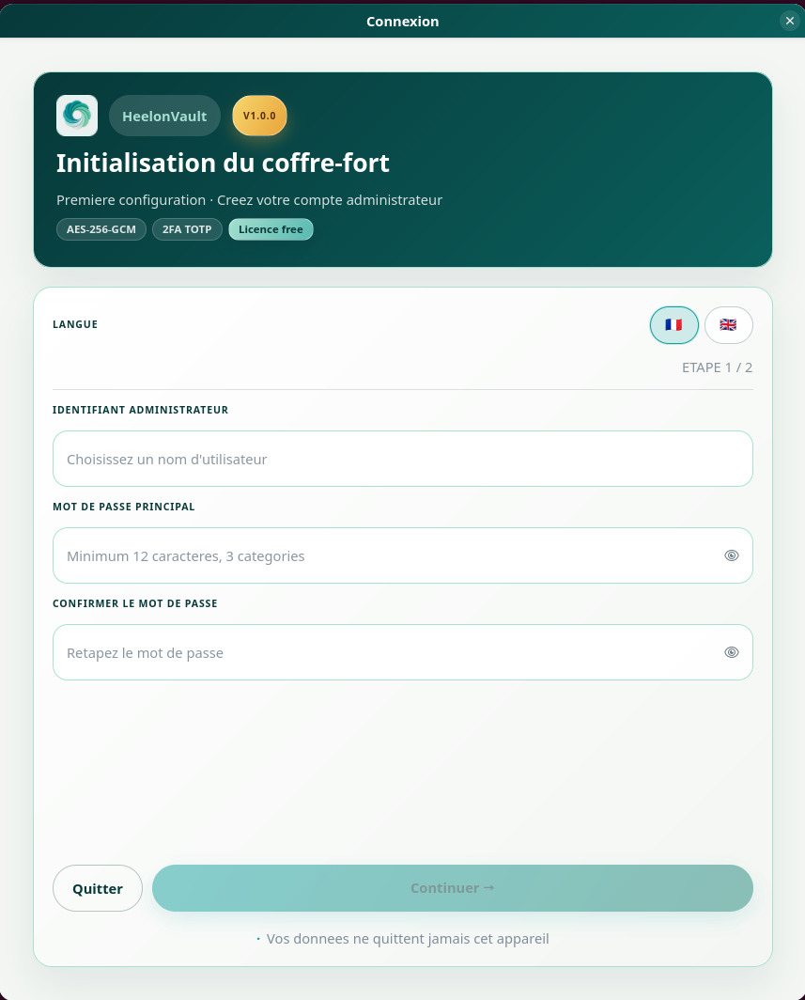

*Assistant d'initialisation, étape 1 (création du compte administrateur).*

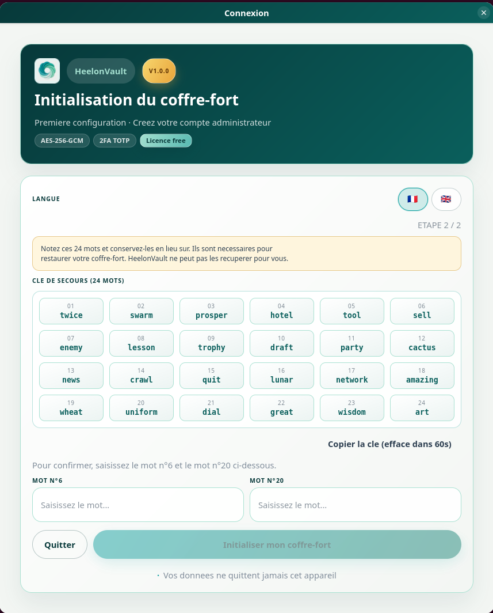

*Assistant d'initialisation, étape 2 (clé de secours 24 mots).*

## 3. Écran 2 - Connexion

Après initialisation, l'écran de connexion permet de saisir les identifiants du compte et, si activé, le code TOTP à usage unique.

Juste après la création du compte, l'écran de connexion affiche le message « Compte créé, connectez-vous. », l'identifiant est déjà renseigné et le curseur est placé dans le champ mot de passe : il suffit de saisir le mot de passe maître choisi à l'étape précédente.

Rôle de l'écran :

- authentifier l'utilisateur ;
- contrôler l'accès au coffre ;
- appliquer les règles de sécurité configurées pour le compte.

Bonnes pratiques :

- utiliser un mot de passe unique et long ;
- conserver la clé de récupération hors poste ;
- vérifier l'heure système si le TOTP est refusé.

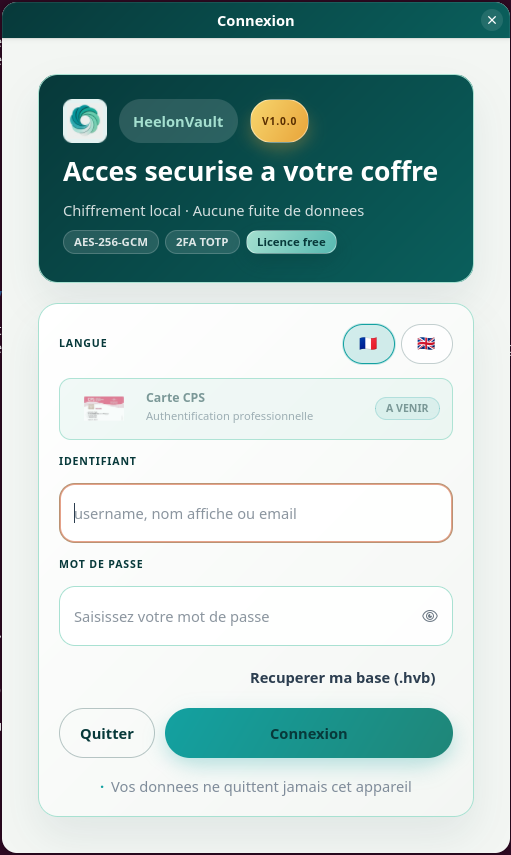

*Écran de connexion avec identifiant, mot de passe et accès récupération de base (.hvb).*

## 4. Écran 3 - Vue principale du coffre

Une fois connecté, l'utilisateur accède à la vue principale du coffre avec :

- la liste des secrets ;
- les fonctions de recherche et filtrage ;
- les actions de création, modification, suppression et partage ;
- l'accès au profil et à la sécurité ;
- un bouton d'aide (icône « ? » dans la barre d'en-tête) qui ouvre la documentation en ligne dans le navigateur.

### Affichage en cartes ou en liste

Deux boutons, à droite des boutons de tri au-dessus de la liste, permettent de choisir la présentation des secrets :

- **Affichage en cartes** (par défaut) : une grille de cartes détaillées, avec login, domaine, badges (robustesse, utilisation, doublon, incomplet, partagé, coffre) et actions rapides ;
- **Affichage en liste** : une ligne compacte par secret, en colonnes alignées — type, titre, login, domaine, badges essentiels (robustesse, doublon, coffre d'origine en recherche multi-coffres) et actions rapides. Pratique pour parcourir rapidement un coffre volumineux.

La recherche, les filtres, le tri, les raccourcis clavier et le double-clic pour modifier fonctionnent de la même façon dans les deux modes, et le changement de mode est instantané. Le choix est mémorisé pour les prochains lancements (préférence de l'installation, commune à tous les comptes du poste).

Rôle de l'écran :

- servir de point d'entrée pour toutes les opérations courantes ;
- centraliser la navigation dans les données du coffre ;
- offrir un accès rapide aux actions prioritaires.

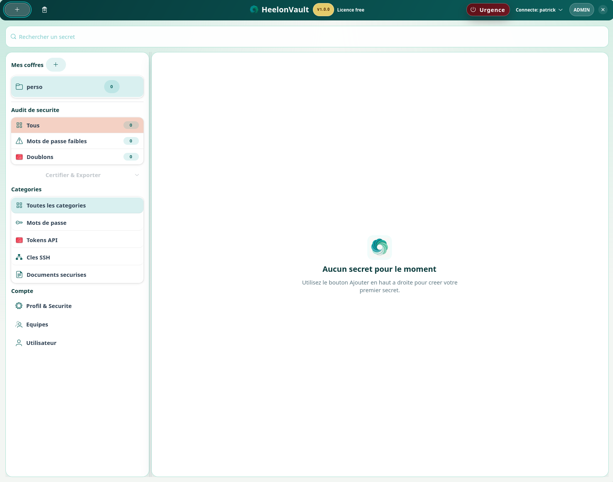

*Vue principale du coffre avec recherche, catégories, audit de sécurité et zone centrale.*

## 5. Écran 4 - Création d'un secret

Pour ajouter un secret :

1. Ouvrir l'action de création.
2. Choisir le type ou la catégorie adaptée.
3. Renseigner les champs utiles : titre, login, mot de passe, URL, notes, tags.
4. Cocher « Accès données de santé » si le secret est lié à des données médicales.
5. Vérifier l'indicateur de robustesse.
6. Enregistrer.

Recommandations :

- utiliser des titres explicites ;
- renseigner les tags pour faciliter la recherche ;
- utiliser le marqueur « Accès données de santé » uniquement pour les secrets réellement sensibles au sens santé ;
- éviter les notes contenant des informations non nécessaires.

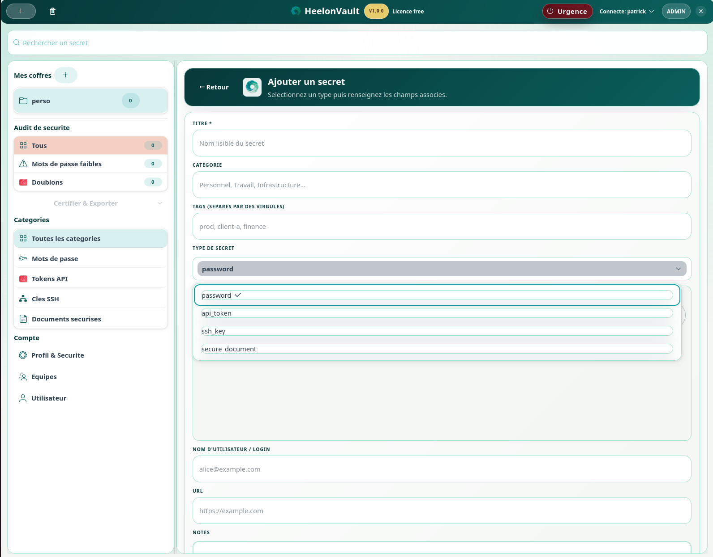

*Choix du type de secret (password, api_token, ssh_key, secure_document).*

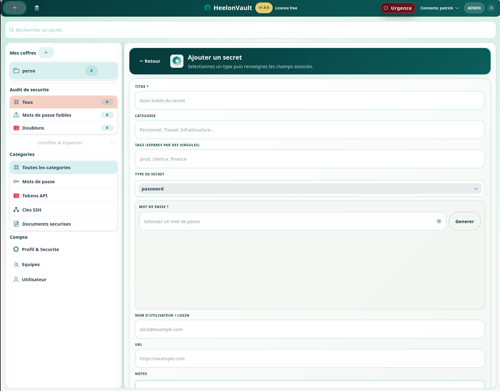

*Création d'un secret de type mot de passe (vue générale du formulaire).*

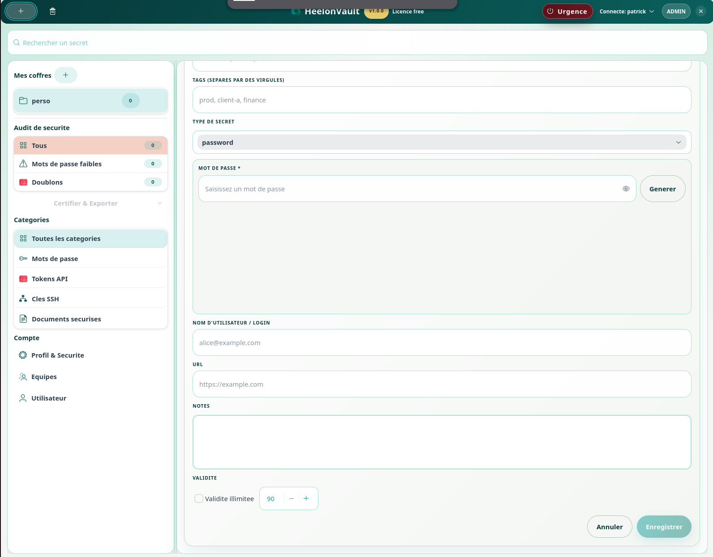

*Paramètres complémentaires d'un secret mot de passe (notes, validité, enregistrement).*

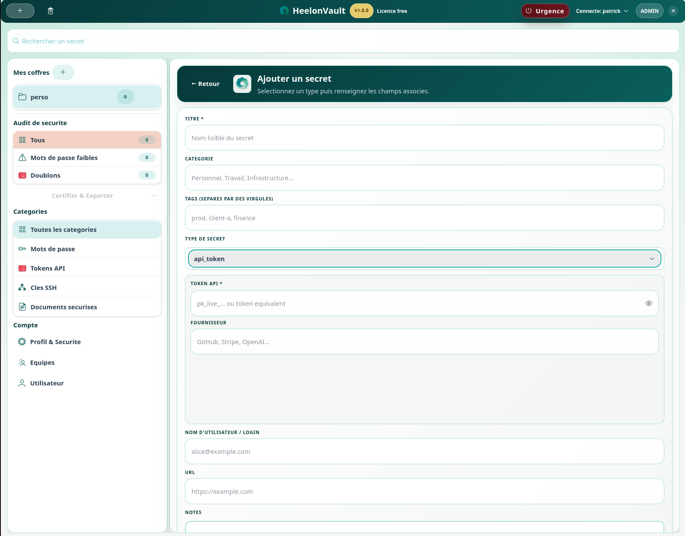

*Création d'un secret de type token API.*

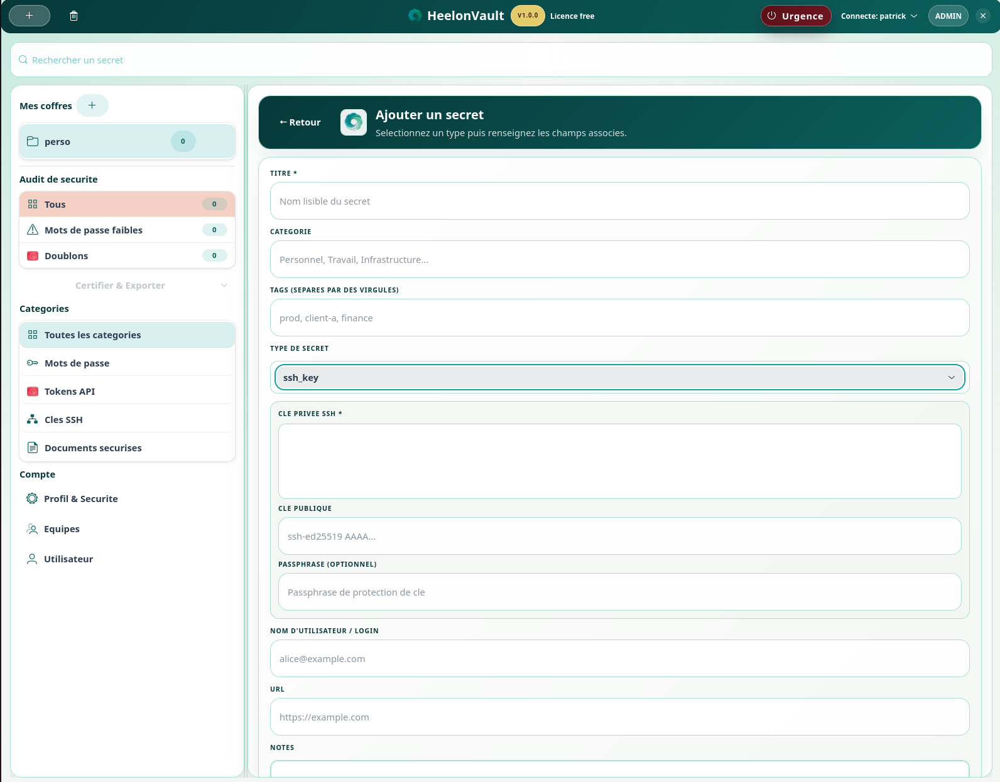

*Création d'un secret de type clé SSH.*

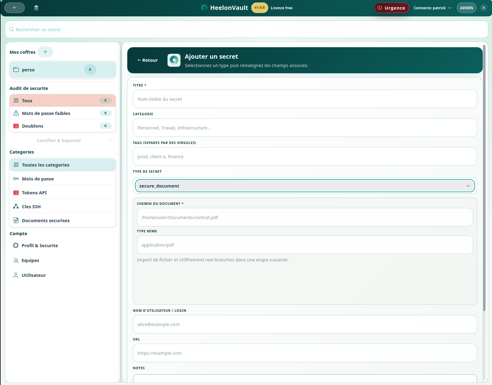

*Création d'un secret de type document sécurisé.*

## 6. Écran 5 - Modification, suppression et corbeille

Chaque secret peut être modifié depuis l'éditeur intégré. La suppression passe par la corbeille afin d'éviter une perte immédiate.

Dans le tableau principal :

- un clic simple sur une carte la sélectionne sans ouvrir l'éditeur ;
- un double-clic ouvre la modification du secret sélectionné.

Rôle de l'écran :

- permettre la maintenance du contenu du coffre ;
- sécuriser la suppression grâce à une étape intermédiaire ;
- offrir une restauration rapide en cas d'erreur.

Flux recommandé :

1. Modifier le secret si nécessaire.
2. Utiliser la suppression logique pour l'envoyer en corbeille.
3. Restaurer le secret en cas d'erreur.
4. Purger définitivement seulement après validation.

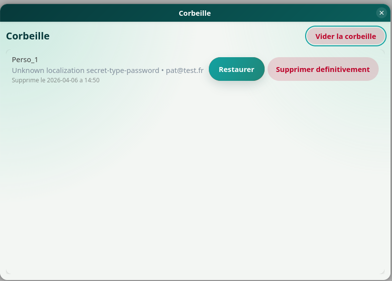

*Corbeille avec actions de restauration et purge des éléments supprimés.*

## 7. Écran 6 - Recherche et organisation

HeelonVault prend en charge une recherche multi-champs en temps réel sur l'ensemble des données des secrets.

### Mode de recherche

- **Coffre actif (défaut)** : la recherche porte sur le coffre sélectionné dans le panneau latéral.
- **MultiCoffre** : activez le bouton **MultiCoffre** à gauche de la barre de recherche pour étendre la recherche à tous les coffres accessibles simultanément.

### Recherche sans préfixe

Un terme tapé seul est recherché dans tous les champs : titre, type, login, email, URL, notes, catégorie, tags et nom du coffre. La correspondance floue tolère une faute de frappe.

### Raccourci thématique `#sante`

Le raccourci `#sante` affiche les secrets marqués « Accès données de santé » et ceux détectés automatiquement avec une confiance élevée.

### Syntaxe `champ:valeur`

Pour cibler un champ précis, utilisez la syntaxe `champ:valeur` (avec ou sans espace après le deux-points) :

| Clés acceptées | Champ recherché |
| --- | --- |
| `title`, `titre`, `name`, `nom` | Titre |
| `login`, `user`, `username`, `identifiant` | Login |
| `email`, `mail` | Email |
| `url`, `site`, `domaine`, `domain` | URL |
| `notes`, `note` | Notes |
| `category`, `categorie`, `cat` | Catégorie |
| `tag`, `tags` | Tags |
| `type`, `kind` | Type de secret |
| `vault`, `coffre`, `vault-name` | Nom du coffre |

Exemples : `login:alice` · `coffre:perso` · `titre:gmail` · `url:google`

Le bouton `?` à droite de la barre affiche ce récapitulatif directement dans l'application.

### Raccourcis clavier sur la carte active

Quand une carte (ou une ligne, en affichage liste) est sélectionnée, les actions rapides suivantes sont disponibles :

- `Ctrl+C` : copier le mot de passe ;
- `Ctrl+L` : copier le login (si présent) ;
- `Ctrl+U` : ouvrir l'URL (si présente).

### Indicateur du presse-papiers

Dans la barre d'en-tête, une icône de presse-papiers indique ce que HeelonVault expose via le presse-papiers :

- **au repos** (icône discrète) : « Aucun secret exposé par HeelonVault » ;
- **après une copie** (icône ambrée) : un anneau se consume pendant le délai d'effacement — 20 s pour un mot de passe ou un identifiant, 60 s pour la phrase de récupération. L'infobulle précise ce qui est copié et le temps restant ;
- **un clic** sur l'icône efface immédiatement le presse-papiers, par exemple juste après avoir collé votre mot de passe.

Si vous copiez autre chose entre-temps, HeelonVault efface aussitôt sa copie et l'indicateur revient au repos.

Ce que l'indicateur ne couvre pas : la clé du coffre ouvert reste en mémoire tant que la session est déverrouillée, et certains outils du système peuvent conserver un historique du presse-papiers (par exemple l'historique Windows, `Win+V`, s'il est activé). Désactivez cet historique sur un poste sensible.

Pour votre sécurité, les mots de passe ne restent pas déchiffrés en mémoire pendant l'affichage de la liste : chaque copie déchiffre le mot de passe au moment du clic, après avoir revérifié vos droits sur le coffre, puis l'efface. Si un partage vous a été retiré entre-temps, ou si la session est verrouillée, un message l'indique et rien n'est copié.

### Bonnes pratiques

Renforcer la pertinence de la recherche avec une organisation cohérente :

- adopter une convention de nommage stable ;
- utiliser les tags de manière cohérente ;
- regrouper les secrets par type, usage ou équipe selon le contexte.

*Barre de recherche avec toggle MultiCoffre et bouton d'aide, navigation latérale.*

## 8. Écran 7 - Profil et sécurité

Depuis le profil, l'utilisateur peut consulter les réglages liés à la sécurité et à la session, notamment :

- l'activation TOTP ;
- la politique d'auto-verrouillage ;
- le changement de mot de passe maître avec rotation des enveloppes de clés de coffre ;
- l'activation du code PIN de déverrouillage rapide ;
- certaines préférences d'affichage selon le rôle et la configuration.

### Code PIN de déverrouillage rapide

HeelonVault propose un déverrouillage rapide par code PIN pour éviter de ressaisir le mot de passe maître après chaque verrouillage automatique.

**Activation** (section Profil → Sécurité de session) :

1. Cliquer sur « Activer le code PIN ».
2. Saisir un code PIN de 4 à 8 chiffres.
3. Confirmer le code PIN.
4. Le PIN est actif immédiatement pour la session en cours.

**Utilisation lors du déverrouillage automatique** :

- Lors d'un verrouillage par inactivité (délai configuré), la fenêtre de saisie du PIN s'affiche.
- Saisir le code PIN et appuyer sur « Déverrouiller ».
- En cas d'erreur, 3 tentatives sont autorisées avant que le cache ne soit effacé.
- Après 3 échecs ou 12 h d'inactivité, le système bascule automatiquement vers la connexion par mot de passe maître.
- Le bouton « Utiliser le mot de passe » permet de revenir à tout moment à la connexion complète.

**Désactivation** :

- Depuis le profil, cliquer sur « Désactiver le code PIN » pour supprimer le cache immédiatement.

**Indicateur de temps de session dans la barre de titre** :

Lorsque le PIN est actif, un badge « PIN actif » apparaît dans la barre de titre de la fenêtre. Ce badge évolue visuellement en fonction du temps restant avant l'expiration du cache :

- **Nominal** (plus de 2 h restantes) : texte blanc semi-transparent, comportement standard.
- **Avertissement** (entre 15 min et 2 h) : bordure et texte ambre — envisager de se redéconnecter pour renouveler la session si besoin.
- **Critique** (moins de 15 min) : badge fond ambre avec animation pulsante, texte affiche « PIN · Xm » (X = minutes restantes). Le cache expirera dans la minute indiquée.

Survoler le badge affiche une infobulle indiquant le temps exact restant (ex. « Expire dans 1h 23m »). Cliquer sur le badge ouvre le panneau de gestion PIN dans la vue profil.

Le badge et son minuteur sont automatiquement supprimés lorsque le cache expire, que la session est déverrouillée avec le mot de passe maître, ou que l'application est fermée.

**Limites de sécurité à retenir** :

- Le PIN ne remplace pas le mot de passe maître ; il accélère uniquement le déverrouillage de session.
- Le cache PIN est strictement en mémoire vive et disparaît à la fermeture de l'application.
- Ne pas choisir un PIN identique à un code déjà utilisé par ailleurs (téléphone, carte bancaire).

Points d'attention généraux :

- activer le TOTP dès que possible ;
- utiliser un délai d'auto-verrouillage court sur poste partagé ;
- après un changement de mot de passe maître, vérifier rapidement l'accès aux coffres principaux ;
- ne jamais laisser une session ouverte sans surveillance.

### Récupération de clé de compte

HeelonVault permet maintenant de récupérer l'accès à votre compte si vous perdez votre mot de passe maître, grâce à une **clé de récupération de compte** générée lors de l'initialisation.

**Initialisation (durant le bootstrap)** :
- Une phrase mnémotechnique de 24 mots (format BIP39) est générée automatiquement.
- Une vérification obligatoire de 2 mots tirés au hasard est requise avant finalisation.
- La clé est copiée dans le presse-papiers avec effacement automatique après 60 secondes.

**Ré-exportation** :
- Depuis `Profil & Sécurité`, vous pouvez ré-exporter votre clé de récupération à tout moment.
- Cette action nécessite une authentification valide et les droits d'administrateur.

**Utilisation pour la récupération** :
- En cas de perte du mot de passe maître, utilisez la clé de récupération pour :
  1. Déverrouiller l'accès à votre compte ;
  2. Réinitialiser votre mot de passe maître ;
  3. Retrouver l'accès à vos coffres existants.

**Bonnes pratiques** :
- Conservez la clé de récupération dans un lieu physique sûr (coffre, enveloppe scellée) ;
- Ne la stockez PAS dans un fichier numérique non chiffré ;
- Ne la partagez avec personne ;
- Vérifiez régulièrement que vous pouvez y accéder.

Cet écran correspond à l'espace de gestion de la confiance utilisateur. C'est ici que se concentrent les réglages qui influencent directement le niveau de protection du coffre.

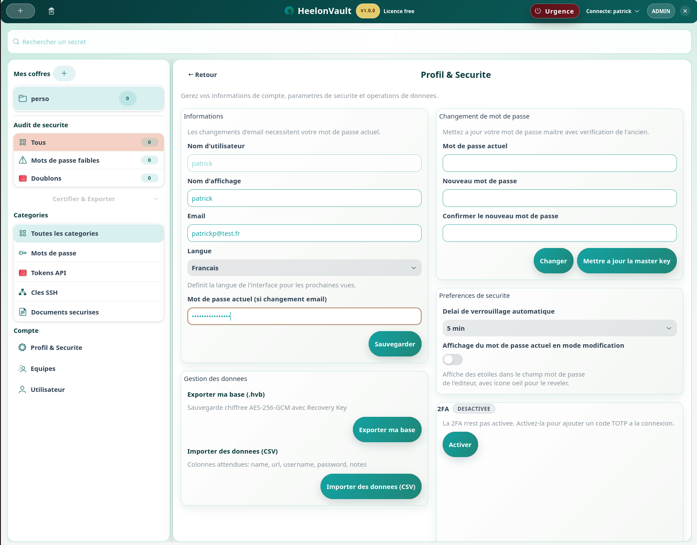

*Paramètres de profil, sécurité de session, TOTP, import/export et préférences.*

## 9. Écran 8 - Import et export

Selon les autorisations disponibles, HeelonVault permet :

- l'import CSV ;
- l'export au format `.hvb` ;
- des opérations encadrées par les règles RBAC.

Le flux d'import CSV est désormais explicite et guidé :

- **Étape 1 - Prévisualisation** : après sélection du fichier, l'application affiche le nombre de secrets détectés, le nombre importable, et les lignes à revoir manuellement.
- **Étape 2 - Progression** : pendant l'import, une fenêtre dédiée affiche l'avancement (traités/importés/en échec) avec mise à jour en continu.
- **Étape 3 - Résumé final** : l'application affiche un bilan détaillé (total/importés/en échec) et liste les premières lignes non importées avec la raison pour correction manuelle.

Avant un import :

- vérifier le format et l'encodage du fichier ;
- nettoyer les colonnes inutiles ;
- confirmer la destination correcte du coffre.
- lire le résumé final et corriger les lignes signalées avant un second import ciblé.
- consulter le chemin du rapport de rejets si affiché (fichier `logs/csv_import_rejects_*.txt`).

Avant un export :

- limiter l'opération au strict besoin ;
- protéger le fichier exporté ;
- supprimer l'artefact après usage si possible.

*Zone Gestion des données (export .hvb et import CSV) accessible dans Profil & Sécurité.*

## 10. Écran 9 - Tableau de bord et audit

Le tableau de bord de sécurité donne une vue synthétique de l'état du coffre. Les journaux d'audit permettent de tracer les actions sensibles.

Le tableau de bord met en avant la productivité quotidienne :

- tri prioritaire des cartes par fréquence d'usage ;
- badges visuels sur les cartes (robustesse, incomplet, doublon, usage, santé) ;
- sélection claire de la carte active pour enchaîner rapidement les actions clavier.

Rôle de l'écran :

- visualiser rapidement les points d'attention ;
- suivre les événements récents ;
- appuyer les revues de sécurité et de conformité.

Utilisations courantes :

- identifier les secrets faibles ;
- vérifier les événements récents ;
- suivre les suppressions, modifications et partages.

*Tableau de bord principal et indicateurs d'audit de sécurité.*

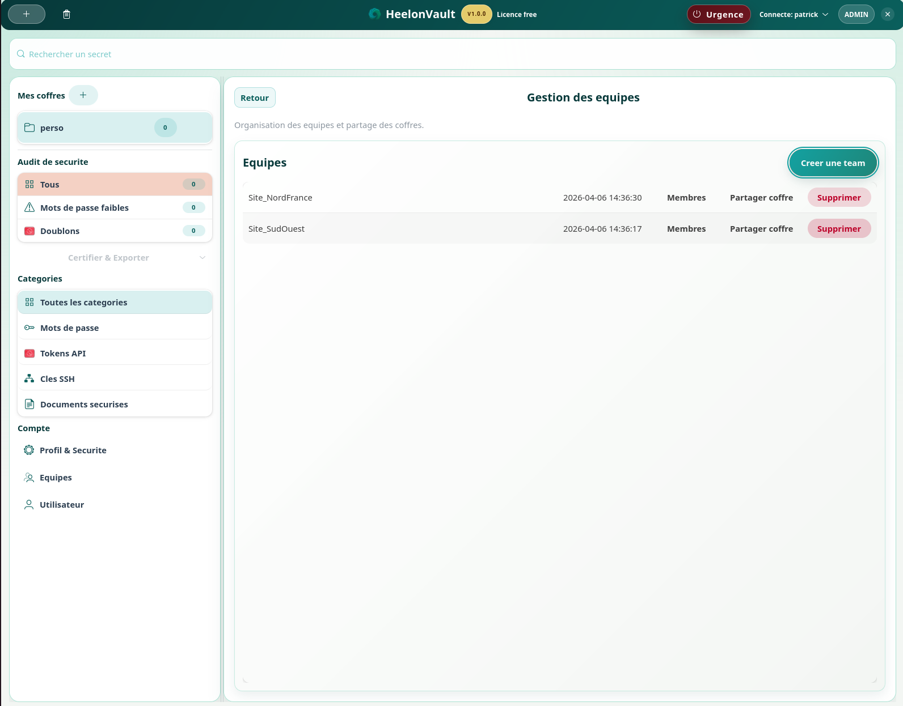

*Vue d'administration des équipes (partage de coffres, gestion des membres).*

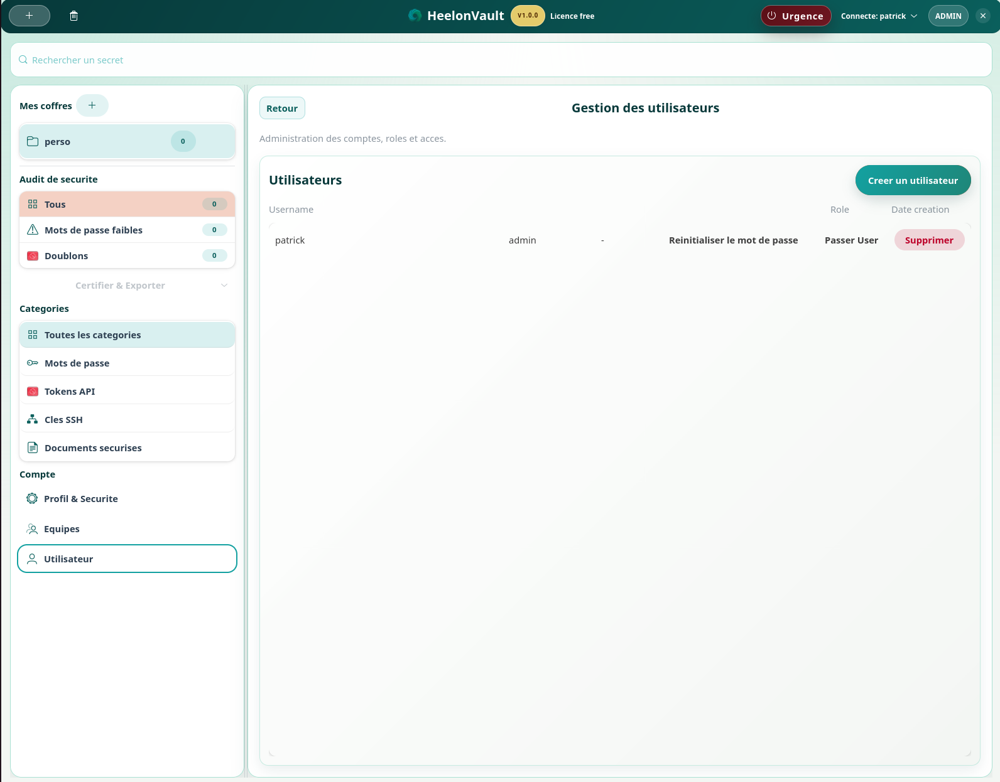

*Vue d'administration des utilisateurs (création, rôles, réinitialisation, suppression).*

## 11. Bonnes pratiques

- Utiliser un mot de passe maître unique et robuste.
- Activer le TOTP dès l'activation du compte.
- Stocker la clé de récupération hors de la machine.
- Verrouiller ou fermer la session en quittant le poste.
- Réviser régulièrement les secrets obsolètes.
- Limiter les exports aux besoins réels.

## 12. Dépannage rapide

### Impossible de se connecter

- vérifier le nom du compte ;
- vérifier le mot de passe ;
- vérifier l'heure système si le TOTP échoue.

### L'application semble verrouillée trop vite

- vérifier le délai d'auto-verrouillage dans les paramètres de session.

### Un secret a disparu

- vérifier la corbeille avant toute conclusion ;
- consulter le journal d'audit si disponible.

### L'import CSV échoue avec une erreur de déchiffrement

- vérifier que le coffre cible est bien accessible avec la session en cours ;
- se déconnecter puis se reconnecter si un changement de mot de passe maître vient d'être effectué ;
- relancer l'import et contrôler le résumé des lignes rejetées.

## Références utiles

- [Installation et démarrage rapide](QUICKSTART.fr.md)
- [Mise à jour et déploiement](UPDATE_GUIDE.md)
- [Sécurité](../SECURITY.fr.md)
- [Architecture](ARCHITECTURE.md)
- [Journal des modifications](CHANGELOG.md)
